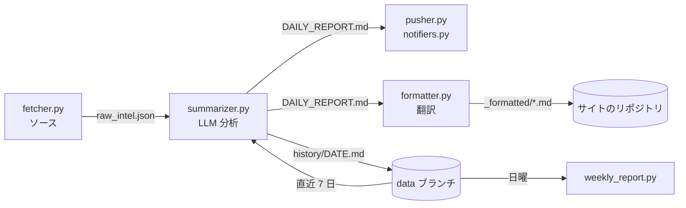

<p align="center">
  <a href="README.md"></a>
  <a href="README.zh-CN.md"></a>
  <a href="README.ja.md"></a>
</p>

<h1 align="center">TechTrend</h1>

<p align="center">
  毎朝 GitHub・Hugging Face・Hacker News・Reddit・Product Hunt を読み込み、<br>
  好きな LLM で切り口のある技術分析を書き、Slack・Telegram・メール・WeChat などに届けます。<br>
  GitHub Actions 上で無料で動き、サーバーは不要です。
</p>

<p align="center">
  <a href="https://github.com/Shinnaaa/TechTrend/actions/workflows/daily-intel.yml"></a>
  
  <a href="LICENSE"></a>
</p>

---

## なぜ作ったか

多くの「AI ニュースまとめ」は、プロジェクトの説明文を言い換えているだけです。TechTrend はその逆を狙っています。各項目には、タイトルからは分からない洞察をひとつ、名前を挙げた具体的な比較、手に入る範囲の実数値、明示的な限界、そして今週中に試せることをひとつ、必ず含めます。「注目に値する」「X を再定義する」といった決まり文句はプロンプトで禁止し、悪い例と良い例を示してモデルに従わせています。

## 届くもの

**毎朝**、次のようなブリーフィングが中国語・英語・日本語のいずれかで届きます。

> **[openwhispr](https://github.com/OpenWhispr/openwhispr)** `JavaScript` ⭐7,427 +121
> 💡 クロスプラットフォームの音声文字起こしアプリ。ローカルは Nvidia Parakeet / Whisper、クラウドは BYOK。分単位課金の Whisper API と比べ、ローカル推論は限界費用ゼロ……限界：BYOK では複数ベンダーの API キーとクォータをユーザー自身が管理する必要がある。
> 🎯 今週、手元の開発機でローカル Parakeet を動かし、同じ 10 本の録音で Whisper API と遅延・精度を比較する。

| セクション | ソース |
|---|---|
| 🔥 GitHub Trending 厳選 | GitHub Trending（言語は自由に選択） |
| 🤗 注目モデル | Hugging Face（`trendingScore` 順） |
| 🧠 AI/ML 最新論文 | Hugging Face Daily Papers |
| 💬 Hacker News | Algolia HN フロントページ |
| 🧵 Reddit | 選んだサブレディットの当日トップ |
| 🚀 Product Hunt | Product Hunt RSS |
| ⚡ パラダイム変化のシグナル | 直近 7 日間をトレンド文脈とした横断的な判断 |
| 🛠️ 今週のアクション | すぐ着手できる PoC・コードリーディング・技術評価 |

ソースはそれぞれ個別にオフにできます。以前に分析した項目は自動で除外され、新規項目が 5 件未満の日は何も送りません。**毎週日曜**には、一週間の強いシグナルとトレンドをまとめた週報も届きます。

---

## クイックスタート

ブラウザだけで、約 10 分で完了します。

### 1. このリポジトリを Fork する

右上の **Fork** をクリックし、**"Copy the `main` branch only"** にチェックを入れたままにします。これで作者の履歴データを引き継がずに始められ、初回実行時にあなた自身のものが作られます。

### 2. LLM の API キーを用意する

OpenAI 互換 API ならどれでも使えます。[`config.yml`](config.yml) の既定は DeepSeek で、安価かつ中国語・英語の文章が得意です。

| プロバイダ | `llm.base_url` | `llm.model` | `llm.thinking` |
|---|---|---|---|
| DeepSeek（既定） | `https://api.deepseek.com` | `deepseek-v4-flash` | `true` |
| OpenAI | `https://api.openai.com/v1` | アカウントで使えるモデル ID | `null` |
| Anthropic Claude | `https://api.anthropic.com/v1/` | 例：`claude-sonnet-5` | `null` |
| Google Gemini | `https://generativelanguage.googleapis.com/v1beta/openai/` | Gemini のモデル ID | `null` |
| Alibaba Qwen | `https://dashscope.aliyuncs.com/compatible-mode/v1` | Qwen のモデル ID | `null` |
| Moonshot Kimi | `https://api.moonshot.cn/v1` | Kimi のモデル ID | `null` |

DeepSeek 以外を使う場合は、`config.yml` のこの 3 行を書き換えてください（GitHub 上の鉛筆アイコンからブラウザで編集できます）。`thinking: null` は重要です。`thinking` パラメータは DeepSeek 固有で、他の API に送るとリクエストが拒否される場合があります。

### 3. Secrets を追加する

Fork したリポジトリで **Settings → Secrets and variables → Actions → New repository secret** を開き、次を追加します。

- `OPENAI_API_KEY`：LLM の API キー（名前は歴史的な理由によるもので、どのプロバイダのキーでも構いません）
- 下の表から、**少なくとも 1 つの配信チャンネル**の Secrets。複数設定すれば複数の場所に届きます。

### 4. ワークフローを有効にする

Fork したリポジトリでは Actions が無効になっています。**Actions** タブを開き、**"I understand my workflows, go ahead and enable them"** をクリックします。

### 5. テストする

1. **Actions → Test Notifications → Run workflow**：設定した各チャンネルに短いテストメッセージが届き、ログに有効なチャンネルの一覧が表示されます。
2. **Actions → Daily Tech Intel → Run workflow**：数分で最初のブリーフィングが届きます。

以降は毎日 UTC 00:00 に自動実行されます。時刻を変えるには [`.github/workflows/daily-intel.yml`](.github/workflows/daily-intel.yml) の `cron` を編集してください（UTC 表記です。`0 23 * * *` で東京の 8:00）。

---

## 配信チャンネル

必須の Secrets がすべて揃ったチャンネルが有効になります。長いブリーフィングは、各プラットフォームの文字数上限に合わせてセクション単位で分割して送ります。

| チャンネル | 必須 Secrets | 任意 | 取得方法 |
|---|---|---|---|
| WeChat（PushPlus） | `PUSHPLUS_TOKEN` | | [pushplus.plus](https://www.pushplus.plus/) → WeChat でログイン → トークンをコピー |
| WeChat（ServerChan） | `SERVERCHAN_SENDKEY` | | [sct.ftqq.com](https://sct.ftqq.com/) → SendKey |
| WeCom グループボット | `WECOM_WEBHOOK_URL` | | グループチャット → ⋯ → ボットを追加 → Webhook URL をコピー |
| Feishu / Lark グループボット | `FEISHU_WEBHOOK_URL` | `FEISHU_SECRET` | グループ設定 → ボット → カスタムボット → Webhook URL（署名検証を有効にした場合はシークレットも） |
| DingTalk グループボット | `DINGTALK_WEBHOOK_URL` | `DINGTALK_SECRET` | グループ設定 → ボット → カスタム → Webhook URL（「署名」を有効にした場合はシークレットも） |
| Telegram | `TELEGRAM_BOT_TOKEN`、`TELEGRAM_CHAT_ID` | | [@BotFather](https://t.me/BotFather) でボットを作成し、一度メッセージを送ってから `https://api.telegram.org/bot<token>/getUpdates` で chat id を確認 |
| Discord | `DISCORD_WEBHOOK_URL` | | チャンネル設定 → 連携サービス → ウェブフック → 新規作成 → URL をコピー |
| Slack | `SLACK_WEBHOOK_URL` | | [アプリを作成](https://api.slack.com/apps) → Incoming Webhooks → チャンネルに追加 |
| メール（SMTP） | `SMTP_HOST`、`SMTP_USERNAME`、`SMTP_PASSWORD`、`EMAIL_TO` | `SMTP_PORT`（465）、`EMAIL_FROM` | メールプロバイダの SMTP 設定。Gmail は `smtp.gmail.com` と[アプリパスワード](https://myaccount.google.com/apppasswords)。`EMAIL_TO` はカンマ区切りで複数指定可 |
| ntfy（スマホ通知） | `NTFY_TOPIC` | `NTFY_SERVER`、`NTFY_TOKEN` | 推測されにくいトピック名を決め、[ntfy アプリ](https://ntfy.sh/)で購読 |
| カスタム Webhook | `WEBHOOK_URL` | | `POST {"title", "content", "format": "markdown", "language"}` を受け取ります |

設定済みのチャンネルのうち一部だけに送りたい場合は、`config.yml` の `notify.channels` に列挙してください。

---

## 設定

Secrets 以外の設定はすべて [`config.yml`](config.yml) にあります。例：

**フロントエンドチーム向けの日本語ブリーフィング**

```yaml
report:
  language: ja
  focus: "フロントエンドとブラウザ技術：React、ビルドツール、CSS、Web API、パフォーマンス。"
```

**サブレディットを追加、GitHub の言語を変更、Product Hunt を無効化**

```yaml
sources:
  github_trending:
    languages: [all, rust, go]
  reddit:
    subreddits: [LocalLLaMA, MachineLearning, programming]
  product_hunt:
    enabled: false
```

| キー | 既定値 | 意味 |
|---|---|---|
| `report.language` | `zh` | ブリーフィングと通知タイトルの言語：`zh`・`en`・`ja` |
| `report.focus` | 空 | 読者の関心分野。項目の選び方と書き方に反映されます |
| `report.min_new_items` | `5` | 新規項目がこれ未満の日はスキップ |
| `llm.model`、`llm.base_url` | DeepSeek | エンドポイント。Secret または Variable の `OPENAI_MODEL` / `OPENAI_BASE_URL` が優先 |
| `llm.thinking` | `true` | DeepSeek の推論スイッチ。他のプロバイダでは `null` |
| `llm.max_tokens` | `7000` | トークン予算（推論オン時は推論と本文で共有） |
| `sources.<name>.enabled` / `max_items` | すべてオン | ソースごとのオン・オフと、モデルに渡す件数 |
| `notify.channels` | `[]`（設定済みすべて） | 配信先をこれらのチャンネルに限定 |
| `weekly.enabled` | `true` | 日曜の週報 |
| `website.languages` | `[zh, en, ja]` | 任意の Web サイト記事の言語 |

---

## 任意：Web サイトに公開する

各ブリーフィングを Jekyll サイトの記事としても公開し、`website.languages` の言語に翻訳できます（作者のサイト：[shinnaaa.github.io](https://shinnaaa.github.io/intel/)）。

1. リポジトリの **Variable**（Settings → Secrets and variables → Actions → Variables）に `WEBSITE_REPO` = `owner/サイトのリポジトリ` を追加。
2. Secret `SYNC_PAT` を追加：そのリポジトリに *Contents: read and write* 権限を持つ [fine-grained token](https://github.com/settings/personal-access-tokens)。

記事は `_posts/YYYY-MM-DD-intel.md` に書き出されます。言語ごとに `<div class="lang-block" lang="…">` があり、front matter には `title_<言語>` と `highlights` が入るので、サイトのテンプレートから利用できます。

---

## 仕組み



| ファイル | 役割 |
|---|---|
| `config.yml`、`config.py` | 設定・既定値・パス |
| `fetcher.py` | 有効なソースをリトライ付きで取得し、過去に見た URL を除外 |
| `summarizer.py` | 新規項目と直近 7 日分の見出しからプロンプトを組み立ててモデルを呼ぶ |
| `notifiers.py`、`pusher.py` | 配信チャンネル。`pusher.py --list` / `--test` で設定を確認 |
| `formatter.py` | 任意の Web 記事：翻訳・言語ブロック・front matter |
| `weekly_report.py` | 日曜に一週間分をまとめる |
| `scripts/state.sh` | `data` ブランチ上の実行データを読み書き |

**実行データは `data` ブランチに保存されます**（`history/` に各ブリーフィング、`seen_urls.json` に重複排除用の記録）。ワークフローは実行のたびにこれを `data/` に取り出し、終了後にコミットし直します。そのため `main` にはコードだけが残り、ボットの毎日のコミットで埋まることはありません。ブランチは初回実行時に自動で作られます。

### 設計メモ

- **推論トークンの予算。** DeepSeek の推論をオンにすると、推論と本文が 1 つの `max_tokens` を共有します。毎回推論トークン数をログに残し、本文が空なら推論をオフにして一度だけ再試行します。
- **配信の前にデータを保存。** 配信チャンネルに問題があっても、翌日に同じ項目を再分析することはありません。
- **1 つのチャンネルが失敗しても他は止まりません。** 配信ステップが失敗扱いになるのは、どのチャンネルにも届かなかった場合だけです。

---

## ローカルで実行する

```bash
pip install -r requirements.txt
cp .env.example .env        # OPENAI_API_KEY と配信チャンネルを記入
python pusher.py --list     # 設定済みのチャンネルを確認
python pusher.py --test     # テストメッセージを送信

python fetcher.py && python summarizer.py && python pusher.py
```

ローカルでは実行データを `./data/`（git 管理外）に保存します。テスト：`pip install pytest && pytest`。

## トラブルシューティング

Actions タブで失敗した実行を開くか、`gh run view <run-id> --log-failed` を実行してください。

| 症状 | 原因 |
|---|---|
| モデル API が `thinking` に触れた `400` を返す | DeepSeek 以外のプロバイダ：`llm.thinking: null` に設定 |
| `400` / `404` でモデルが見つからない | モデル名の誤り、またはプロバイダ側の名称変更：`llm.model` か `OPENAI_MODEL` を修正 |
| モデル API が `401` を返す | `OPENAI_API_KEY` の誤り、または `llm.base_url` と別のプロバイダのキー |
| `402 Insufficient Balance` | API アカウントの残高不足 |
| `No push channel configured` の警告 | 必須 Secrets が揃ったチャンネルがない。上の表を参照 |
| `Model returned an empty report` | 推論が予算を使い切った：`llm.max_tokens` を増やす |
| 実行は成功したが何も届かず、ログに `skipping` | その日の新規項目が `min_new_items` 未満（仕様通り） |

## コントリビュート

配信チャンネルの追加は、[`notifiers.py`](notifiers.py) に関数 1 つと `Channel(...)` を 1 行、`tests/` にテストを足すだけです。ソースの追加は、`fetcher.py` に取得関数、設定に項目、`summarizer.py` にセクションの書き方を加えます。Issue や Pull Request を歓迎します。

## ライセンス

[MIT](LICENSE)
