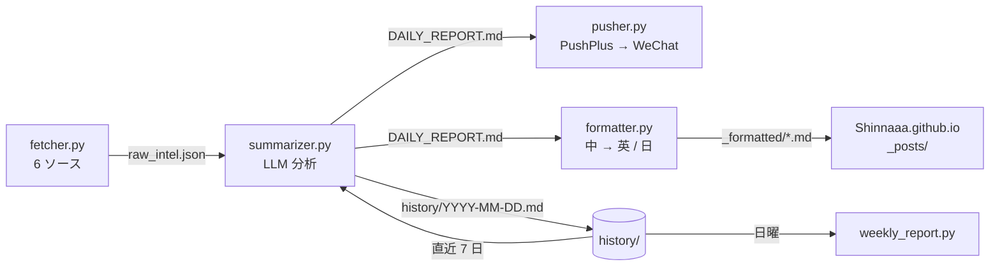

<p align="center">
  <a href="README.md"></a>
  <a href="README.zh-CN.md"></a>
  <a href="README.ja.md"></a>
</p>

<h1 align="center">TechTrend</h1>

<p align="center">
  毎朝 GitHub・Hugging Face・Hacker News・Reddit・Product Hunt を読み込み、<br>
  LLM で切り口のある技術分析を書き、WeChat へ配信し、中英日の三言語ブログとして公開します。
</p>

<p align="center">
  <a href="https://github.com/Shinnaaa/TechTrend/actions/workflows/daily-intel.yml"></a>
  <a href="https://github.com/Shinnaaa/TechTrend/actions/workflows/weekly-intel.yml"></a>
  
</p>

---

## なぜ作ったか

多くの「AI ニュースまとめ」は、プロジェクトの説明文を言い換えているだけです。TechTrend はその逆を狙っています。各項目には、タイトルからは分からない洞察をひとつ、名前を挙げた具体的な比較、手に入る範囲の実数値、明示的な限界、そして今週中に試せることをひとつ、必ず含めます。「注目に値する」「X を再定義する」といった決まり文句はプロンプトで禁止し、悪い例と良い例を示してモデルに従わせています。

## 届くもの

**毎日 北京時間 08:00（UTC 00:00）**、次のセクションからなるブリーフィング：

| セクション | ソース |
|---|---|
| 🔥 GitHub Trending 厳選 | GitHub Trending（全言語・Python・TypeScript） |
| 🤗 Hugging Face 注目モデル | Hugging Face モデル API（`trendingScore` 順） |
| 🧠 AI/ML 最新論文 | Hugging Face Daily Papers |
| 💬 Hacker News | Algolia HN フロントページ |
| 🧵 r/LocalLLaMA | Reddit 当日トップ RSS |
| 🚀 Product Hunt | Product Hunt RSS |
| ⚡ パラダイム変化のシグナル | 直近 7 日間をトレンド文脈とした横断的な判断 |
| 🛠️ 今週のアクション | すぐ着手できる PoC・コードリーディング・技術評価 |

項目の例：

> **[openwhispr](https://github.com/OpenWhispr/openwhispr)** `JavaScript` ⭐7,427 +121
> 💡 クロスプラットフォームの音声文字起こしアプリ。ローカルは Nvidia Parakeet / Whisper、クラウドは BYOK。分単位課金の Whisper API と比べ、ローカル推論は限界費用ゼロ……限界：BYOK では複数ベンダーの API キーとクォータをユーザー自身が管理する必要がある。
> 🎯 今週、手元の開発機でローカル Parakeet を動かし、同じ 10 本の録音で Whisper API と遅延・精度を比較する。

**毎週日曜 北京時間 09:00**、週報が直近 7 日分の日報を、今週最も強いシグナル・強まり続けるトレンド・新たな兆し・警戒すべき逆シグナル・来週の注目点にまとめます。

## 仕組み



| ファイル | 役割 |
|---|---|
| `fetcher.py` | 6 ソースをリトライ付きで取得。`seen_urls.json` にある URL を除外し、同じプロジェクトを二度分析しない。 |
| `summarizer.py` | 新規項目と直近 7 日分の見出しからプロンプトを組み立ててモデルを呼び、`DAILY_REPORT.md` と `history/<日付>.md` を書き出す。新規項目が 5 件未満の日はスキップ。 |
| `pusher.py` | PushPlus 経由で WeChat に配信。レポートがなければ何もしない。 |
| `formatter.py` | レポートを英語と日本語に翻訳し、三言語を言語ブロックで包んで Jekyll の front matter を付ける。 |
| `weekly_report.py` | `history/` の直近 7 日分をまとめて週報を生成・配信。 |

日次ワークフローは `seen_urls.json` と `history/` をこのリポジトリにコミットし直すので、重複排除の状態とトレンド文脈が実行をまたいで保たれます（週次ワークフローは `history/weekly_*.md` をコミット）。その後、整形済みの記事を [Shinnaaa.github.io](https://github.com/Shinnaaa/Shinnaaa.github.io) リポジトリにコピーし、三言語のブログ記事として公開します。

### 設計メモ

- **推論トークンの予算。** モデルは thinking を有効にして動かしています。推論と本文は同じ `max_tokens` を共有するため、呼び出しには 7,000 トークンを割り当て、毎回推論トークン数をログに残します。それでも本文が空なら、thinking を無効にして 3,500 トークンで一度だけ再試行し、両方失敗した場合にのみエラーにします。
- **翻訳では推論しない。** `formatter.py` は thinking を無効にしています。翻訳には推論の効果がなく、有効にすると時間が倍かかるだけです。翻訳に失敗しても中国語版で公開を続け、配信は止めません。
- **静かな日は静かに。** 新規項目が `MIN_NEW_ITEMS = 5` 件未満なら、配信も投稿もしません。

## セットアップ

### 1. リポジトリの Secrets

| Secret | 用途 |
|---|---|
| `OPENAI_API_KEY` | OpenAI 互換エンドポイントのキー（現在は DeepSeek の中継サービス） |
| `OPENAI_BASE_URL` | そのエンドポイントの base URL |
| `OPENAI_MODEL` | モデル名（例：`deepseek-v4-flash`） |
| `PUSHPLUS_TOKEN` | WeChat 配信用の [PushPlus](https://www.pushplus.plus/) トークン |
| `SYNC_PAT` | Web サイトリポジトリへの書き込み権限を持つ fine-grained PAT |

### 2. 実行

ワークフローはスケジュールで自動実行されます。手動で起動する場合：

```bash
gh workflow run daily-intel.yml  --repo Shinnaaa/TechTrend
gh workflow run weekly-intel.yml --repo Shinnaaa/TechTrend
```

### 3. ローカル実行

```bash
pip install -r requirements.txt

export OPENAI_API_KEY=...  OPENAI_BASE_URL=...  OPENAI_MODEL=deepseek-v4-flash
export PUSHPLUS_TOKEN=...

python fetcher.py && python summarizer.py && python pusher.py
```

## トラブルシューティング

まず `gh run view <run-id> --log-failed` を実行し、API 呼び出しのステータスコードを確認してください。

| 症状 | 原因 |
|---|---|
| モデル API が `400` を返す | プロバイダがモデル名を変更した。Secret の `OPENAI_MODEL` を更新する |
| `402 Insufficient Balance` | API アカウントの残高不足 |
| formatter が `DAILY_REPORT.md is empty` で終了 | モデルがトークン予算をすべて推論に使った。ログの推論トークン数を確認し、`THINKING_MAX_TOKENS` を増やす |
| 週報が `No history files found` を出す | その週に成功した日報が一つもない。先に日次の実行を直す |

## リポジトリ構成

```
.github/workflows/   daily-intel.yml、weekly-intel.yml
history/             1 日 1 本の Markdown ブリーフィングと weekly_*.md（CI がコミット）
seen_urls.json       重複排除の状態（CI がコミット）
*.py                 パイプラインの各ステージ
AGENT.md             AI コーディングエージェント向けの作業メモ：判断・落とし穴・変更履歴
```
