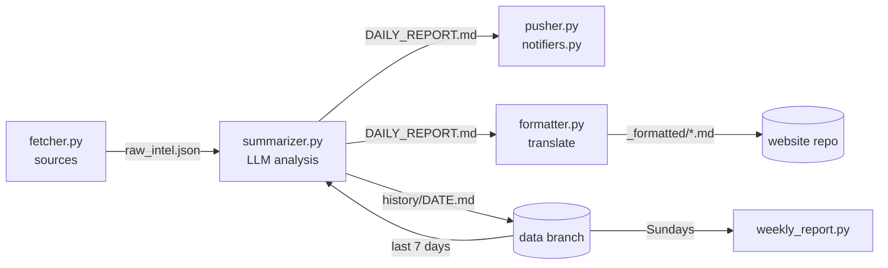

<p align="center">
  <a href="README.md"></a>
  <a href="docs/README.zh-CN.md"></a>
  <a href="docs/README.ja.md"></a>
</p>

<h1 align="center">TechTrend</h1>

<p align="center">
  A daily tech-intelligence briefing that reads GitHub, Hugging Face, Hacker News, Reddit and Product Hunt,<br>
  writes opinionated analysis with any LLM, and delivers it to WeChat, Telegram, Slack, email and more.<br>
  Runs free on GitHub Actions. No server.
</p>

<p align="center">
  <a href="https://github.com/Shinnaaa/TechTrend/actions/workflows/daily-intel.yml"></a>
  
  <a href="LICENSE"></a>
</p>

---

## Why

Most "AI news digests" restate the project description in nicer words. TechTrend is tuned for the opposite: every item must carry one non-obvious insight, a concrete comparison against a named alternative, real numbers where they exist, a stated limitation, and one thing you could try this week. Phrases like "worth watching" or "redefines X" are banned in the prompt, with bad/good examples the model is asked to follow.

## What you get

**Every morning** a briefing like this, in Chinese, English or Japanese:

> **[openwhispr](https://github.com/OpenWhispr/openwhispr)** `JavaScript` ⭐7,427 +121
> 💡 Cross-platform speech-to-text: local Nvidia Parakeet / Whisper, cloud via BYOK. Compared with the per-minute Whisper API, local inference has zero marginal cost… Limitation: with BYOK the user manages keys and quotas across several vendors.
> 🎯 This week: run local Parakeet on 10 recordings and compare latency and accuracy against the Whisper API.

| Section | Source |
|---|---|
| 🔥 GitHub Trending picks | GitHub Trending (languages of your choice) |
| 🤗 Trending models | Hugging Face, sorted by `trendingScore` |
| 🧠 AI/ML papers | Hugging Face Daily Papers |
| 💬 Hacker News | Algolia HN front page |
| 🧵 Reddit | Top-of-day posts from subreddits of your choice |
| 🚀 Product Hunt | Product Hunt RSS |
| ⚡ Paradigm-shift signals | Cross-source synthesis, with the last 7 days as trend context |
| 🛠️ This week's actions | Concrete PoCs, code reads or evaluations to try |

Every source can be switched off. Items already analysed on earlier days are skipped, and on quiet days (fewer than 5 new items) nothing is sent. **Every Sunday** a weekly report distils the week into top signals and trends.

---

## Quick Start

About 10 minutes, all in the browser.

### 1. Fork this repository

Click **Fork**. Keep **"Copy the `main` branch only"** checked: your copy then starts with no history of its own, and the first run creates it.

### 2. Get an LLM API key

Any OpenAI-compatible API works. The default in [`config.yml`](config.yml) is DeepSeek, which is inexpensive and writes well in Chinese and English:

| Provider | `llm.base_url` | `llm.model` | `llm.thinking` |
|---|---|---|---|
| DeepSeek *(default)* | `https://api.deepseek.com` | `deepseek-v4-flash` | `true` |
| OpenAI | `https://api.openai.com/v1` | a model id from your account | `null` |
| Anthropic Claude | `https://api.anthropic.com/v1/` | e.g. `claude-sonnet-5` | `null` |
| Google Gemini | `https://generativelanguage.googleapis.com/v1beta/openai/` | a Gemini model id | `null` |
| Alibaba Qwen | `https://dashscope.aliyuncs.com/compatible-mode/v1` | a Qwen model id | `null` |
| Moonshot Kimi | `https://api.moonshot.cn/v1` | a Kimi model id | `null` |

If you don't use DeepSeek, edit those three lines in `config.yml` (the pencil icon on GitHub edits in the browser). `thinking: null` matters: the `thinking` parameter is DeepSeek-specific, and other APIs may reject the request if it is sent.

### 3. Add secrets

In your fork, open **Settings → Secrets and variables → Actions → New repository secret** and add:

- `OPENAI_API_KEY` — your LLM key (the name is historical; it holds any provider's key)
- the secrets of **at least one push channel** from the table below. Add several to receive the briefing in several places.

### 4. Enable the workflows

Forks start with Actions disabled. Open the **Actions** tab and click **"I understand my workflows, go ahead and enable them"**.

### 5. Test it

1. **Actions → Test Notifications → Run workflow.** Each configured channel receives a short test message; the log lists which channels are active.
2. **Actions → Daily Tech Intel → Run workflow.** Your first briefing arrives in a few minutes.

From then on it runs every day at 00:00 UTC. To change the time, edit the `cron` line in [`.github/workflows/daily-intel.yml`](.github/workflows/daily-intel.yml) (it is in UTC: `0 23 * * *` is 08:00 in Tokyo, `0 13 * * *` is 09:00 in New York).

---

## Push channels

A channel is active when all its required secrets are set. Long briefings are split at section boundaries to fit each platform's message limit.

| Channel | Required secrets | Optional | Where to get them |
|---|---|---|---|
| WeChat via PushPlus | `PUSHPLUS_TOKEN` | | [pushplus.plus](https://www.pushplus.plus/) → log in with WeChat → copy your token |
| WeChat via ServerChan | `SERVERCHAN_SENDKEY` | | [sct.ftqq.com](https://sct.ftqq.com/) → SendKey |
| WeCom group bot | `WECOM_WEBHOOK_URL` | | Group chat → ⋯ → Add group bot → copy webhook URL |
| Feishu / Lark group bot | `FEISHU_WEBHOOK_URL` | `FEISHU_SECRET` | Group settings → Bots → Custom bot → webhook URL (+ signature secret if enabled) |
| DingTalk group bot | `DINGTALK_WEBHOOK_URL` | `DINGTALK_SECRET` | Group settings → Bots → Custom → webhook URL (+ "sign" secret if enabled) |
| Telegram | `TELEGRAM_BOT_TOKEN`, `TELEGRAM_CHAT_ID` | | Create a bot with [@BotFather](https://t.me/BotFather); message it once, then read your chat id from `https://api.telegram.org/bot<token>/getUpdates` |
| Discord | `DISCORD_WEBHOOK_URL` | | Channel settings → Integrations → Webhooks → New webhook → copy URL |
| Slack | `SLACK_WEBHOOK_URL` | | [Create an app](https://api.slack.com/apps) → Incoming Webhooks → add to a channel |
| Email (SMTP) | `SMTP_HOST`, `SMTP_USERNAME`, `SMTP_PASSWORD`, `EMAIL_TO` | `SMTP_PORT` (465), `EMAIL_FROM` | Your mail provider's SMTP settings. Gmail: `smtp.gmail.com` with an [app password](https://myaccount.google.com/apppasswords). `EMAIL_TO` takes a comma-separated list |
| ntfy (phone push) | `NTFY_TOPIC` | `NTFY_SERVER`, `NTFY_TOKEN` | Pick a hard-to-guess topic name and subscribe to it in the [ntfy app](https://ntfy.sh/) |
| Custom webhook | `WEBHOOK_URL` | | Receives `POST {"title", "content", "format": "markdown", "language"}` |

To send to only some of the configured channels, list them under `notify.channels` in `config.yml`.

---

## Configuration

Everything that isn't a secret is in [`config.yml`](config.yml). A few examples:

**English briefing for a frontend team**

```yaml
report:
  language: en
  focus: "Frontend and browser tech: React, build tools, CSS, Web APIs, performance."
```

**More subreddits, different GitHub languages, no Product Hunt**

```yaml
sources:
  github_trending:
    languages: [all, rust, go]
  reddit:
    subreddits: [LocalLLaMA, MachineLearning, programming]
  product_hunt:
    enabled: false
```

| Key | Default | Meaning |
|---|---|---|
| `report.language` | `zh` | Language of the briefing and push titles: `zh`, `en`, `ja` |
| `report.focus` | empty | What your readers care about; steers selection and framing |
| `report.min_new_items` | `5` | Skip the day below this many new items |
| `llm.model`, `llm.base_url` | DeepSeek | Endpoint; the `OPENAI_MODEL` / `OPENAI_BASE_URL` secrets or variables override them |
| `llm.thinking` | `true` | DeepSeek reasoning switch; `null` for every other provider |
| `llm.max_tokens` | `7000` | Token budget (reasoning and report share it when thinking is on) |
| `sources.<name>.enabled` / `max_items` | all on | Per-source switch and how many items go to the model |
| `notify.channels` | `[]` (all configured) | Restrict delivery to these channels |
| `weekly.enabled` | `true` | Sunday weekly report |
| `website.languages` | `[zh, en, ja]` | Languages of the optional website post |

---

## Optional: publish to a website

Each briefing can also become a post in a Jekyll site, translated into the languages in `website.languages` (this project's author runs it on [shinnaaa.github.io](https://shinnaaa.github.io/intel/)).

1. Add a repository **variable** (Settings → Secrets and variables → Actions → Variables) `WEBSITE_REPO` = `owner/your-site-repo`.
2. Add a secret `SYNC_PAT`: a [fine-grained token](https://github.com/settings/personal-access-tokens) with *Contents: read and write* on that repository.

Posts go to `_posts/` as `YYYY-MM-DD-intel.md`, one `<div class="lang-block" lang="…">` per language plus `title_<lang>` and `highlights` in the front matter, for your site's templates to use.

---

## How it works



| File | Role |
|---|---|
| `config.yml`, `techtrend/config.py` | Settings, defaults, paths |
| `techtrend/fetcher.py` | Pulls the enabled sources with retries; drops URLs seen on earlier days |
| `techtrend/summarizer.py` | Builds the prompt from new items plus 7 days of headlines, calls the model |
| `techtrend/notifiers.py`, `techtrend/pusher.py` | Delivery channels; `python -m techtrend.pusher --list` / `--test` for checking your setup |
| `techtrend/formatter.py` | Optional website post: translation, language blocks, front matter |
| `techtrend/weekly_report.py` | Sunday summary of the week's briefings |
| `scripts/state.sh` | Loads and saves run state on the `data` branch |

**State lives on the `data` branch** (`history/` with every briefing, and `seen_urls.json` for deduplication). The workflows check it out into `data/` and commit back after each run, so `main` holds only code and never collects bot commits. The branch is created on the first run.

### Design notes

- **Reasoning budget.** With DeepSeek thinking on, reasoning and the answer share one `max_tokens` budget. The call logs the reasoning-token count; if the report comes back empty or cut off at the limit (busy days with many new items), it is rewritten once with thinking off so the whole budget goes to the text.
- **State is saved before delivery**, so a broken push channel never makes the next day analyse the same items again.
- **One broken channel doesn't stop the others.** The push step only fails when no channel got through.

---

## Run locally

```bash
pip install -r requirements.txt
cp .env.example .env        # then fill in OPENAI_API_KEY and a channel
python -m techtrend.pusher --list     # which channels are configured
python -m techtrend.pusher --test     # send a test message

python -m techtrend.fetcher && python -m techtrend.summarizer && python -m techtrend.pusher
```

Locally, state is kept in `./data/` (git-ignored). Tests: `pip install pytest && pytest`.

## Troubleshooting

Open the failed run in the Actions tab, or run `gh run view <run-id> --log-failed`.

| Symptom | Cause |
|---|---|
| `400` from the model API mentioning `thinking` | Your provider isn't DeepSeek: set `llm.thinking: null` |
| `400` / `404` model not found | Wrong or renamed model: fix `llm.model` or the `OPENAI_MODEL` secret |
| `401` from the model API | Wrong `OPENAI_API_KEY`, or the key doesn't match `llm.base_url` |
| `402 Insufficient Balance` | The API account is out of credit |
| `No push channel configured` warning | No channel has all its required secrets; see the table above |
| `Model returned an empty report`, or a "hit the token limit" warning | Reasoning used most of the budget even after the retry: raise `llm.max_tokens` |
| Nothing arrived, run is green, log says `skipping` | Fewer than `min_new_items` new items that day, by design |

## Contributing

Adding a push channel is one function plus one `Channel(...)` entry in [`notifiers.py`](techtrend/notifiers.py), and a test in `tests/`. Adding a source is a fetch function in `techtrend/fetcher.py`, a config entry, and a section guide in `techtrend/summarizer.py`. Issues and pull requests are welcome.

## License

[MIT](LICENSE)
