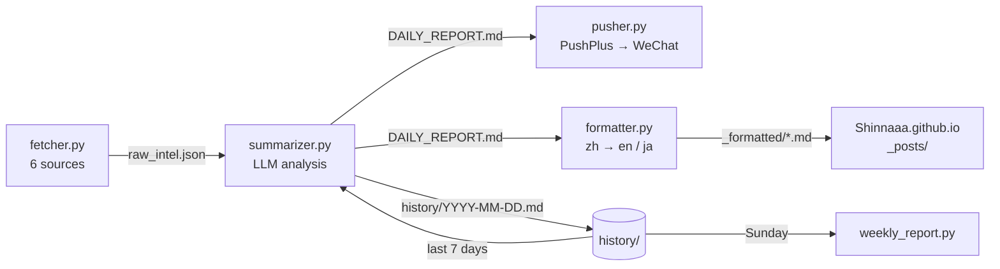

<p align="center">
  <a href="README.md"></a>
  <a href="README.zh-CN.md"></a>
  <a href="README.ja.md"></a>
</p>

<h1 align="center">TechTrend</h1>

<p align="center">
  A daily tech-intelligence briefing that reads GitHub, Hugging Face, Hacker News, Reddit and Product Hunt,<br>
  writes opinionated analysis with an LLM, and delivers it to WeChat and a trilingual blog every morning.
</p>

<p align="center">
  <a href="https://github.com/Shinnaaa/TechTrend/actions/workflows/daily-intel.yml"></a>
  <a href="https://github.com/Shinnaaa/TechTrend/actions/workflows/weekly-intel.yml"></a>
  
</p>

---

## Why

Most "AI news digests" restate the project description in nicer words. TechTrend is tuned for the opposite: every item must carry one non-obvious insight, a concrete comparison against a named alternative, real numbers where they exist, a stated limitation, and one thing you could actually try this week. Phrases like "worth watching" or "redefines X" are banned in the prompt, with bad/good examples the model is asked to follow.

## What you get

**Every day at 08:00 Beijing time (00:00 UTC)**, a briefing with these sections:

| Section | Source |
|---|---|
| 🔥 GitHub Trending picks | GitHub Trending (all languages, Python, TypeScript) |
| 🤗 Hugging Face trending models | Hugging Face models API, sorted by `trendingScore` |
| 🧠 AI/ML papers | Hugging Face Daily Papers |
| 💬 Hacker News | Algolia HN front page |
| 🧵 r/LocalLLaMA | Reddit top-of-day RSS |
| 🚀 Product Hunt | Product Hunt RSS |
| ⚡ Paradigm-shift signals | Cross-source synthesis, using the last 7 days as trend context |
| 🛠️ This week's actions | Concrete PoCs, code reads or evaluations to try |

A sample entry:

> **[openwhispr](https://github.com/OpenWhispr/openwhispr)** `JavaScript` ⭐7,427 +121
> 💡 Cross-platform speech-to-text: local Nvidia Parakeet / Whisper, cloud via BYOK. Compared with the per-minute Whisper API, local inference has zero marginal cost… Limitation: with BYOK the user manages keys and quotas across several vendors.
> 🎯 This week: run local Parakeet on 10 recordings and compare latency and accuracy against the Whisper API.

**Every Sunday at 09:00 Beijing time**, a weekly report distils the last 7 daily briefings into top signals, strengthening trends, emerging signals, counter-signals and next week's focus.

## How it works



| File | Role |
|---|---|
| `fetcher.py` | Scrapes and calls the 6 sources, with retries. Drops URLs already in `seen_urls.json` so the same project is never analysed twice. |
| `summarizer.py` | Builds the prompt from new items plus 7 days of history headlines, calls the model, writes `DAILY_REPORT.md` and `history/<date>.md`. Skips the day when fewer than 5 new items were found. |
| `pusher.py` | Sends the report to WeChat through PushPlus. Does nothing when there is no report. |
| `formatter.py` | Translates the report to English and Japanese, wraps the three versions in language blocks and adds Jekyll front matter. |
| `weekly_report.py` | Summarises the last 7 files in `history/` and pushes the weekly report. |

The daily workflow commits `seen_urls.json` and `history/` back to this repository, so deduplication and trend context survive between runs (the weekly workflow commits `history/weekly_*.md`). It then copies the formatted post into the [Shinnaaa.github.io](https://github.com/Shinnaaa/Shinnaaa.github.io) repository, where it is published as a trilingual blog post.

### Design notes

- **Reasoning budget.** The model runs with thinking enabled. Reasoning and the answer share one `max_tokens` budget, so the call uses 7,000 tokens and logs the reasoning-token count on every run. If the answer still comes back empty, it retries once with thinking disabled and 3,500 tokens before failing.
- **Translation without thinking.** `formatter.py` disables thinking, since translation gains nothing from it and takes twice as long with it on. If translation fails, the post falls back to Chinese rather than blocking publication.
- **Quiet days stay quiet.** Fewer than `MIN_NEW_ITEMS = 5` new items means no push and no post.

## Setup

### 1. Repository secrets

| Secret | Purpose |
|---|---|
| `OPENAI_API_KEY` | Key for any OpenAI-compatible endpoint (currently a DeepSeek relay) |
| `OPENAI_BASE_URL` | Base URL of that endpoint |
| `OPENAI_MODEL` | Model name, e.g. `deepseek-v4-flash` |
| `PUSHPLUS_TOKEN` | [PushPlus](https://www.pushplus.plus/) token for WeChat delivery |
| `SYNC_PAT` | Fine-grained PAT with write access to the website repository |

### 2. Run it

The workflows run on schedule. To trigger one by hand:

```bash
gh workflow run daily-intel.yml  --repo Shinnaaa/TechTrend
gh workflow run weekly-intel.yml --repo Shinnaaa/TechTrend
```

### 3. Run locally

```bash
pip install -r requirements.txt

export OPENAI_API_KEY=...  OPENAI_BASE_URL=...  OPENAI_MODEL=deepseek-v4-flash
export PUSHPLUS_TOKEN=...

python fetcher.py && python summarizer.py && python pusher.py
```

## Troubleshooting

Start with `gh run view <run-id> --log-failed` and look at the status code of the API call:

| Symptom | Cause |
|---|---|
| `400` from the model API | The provider renamed the model. Update the `OPENAI_MODEL` secret. |
| `402 Insufficient Balance` | The API account is out of credit. |
| `DAILY_REPORT.md is empty` in the formatter | The model spent the whole token budget on reasoning. Check the logged reasoning-token count and raise `THINKING_MAX_TOKENS`. |
| Weekly report says `No history files found` | No daily report succeeded that week. Fix the daily run first. |

## Repository layout

```
.github/workflows/   daily-intel.yml, weekly-intel.yml
history/             one Markdown briefing per day, plus weekly_*.md (committed by CI)
seen_urls.json       deduplication state (committed by CI)
*.py                 pipeline stages
AGENT.md             working notes for AI coding agents: decisions, pitfalls, history
```
