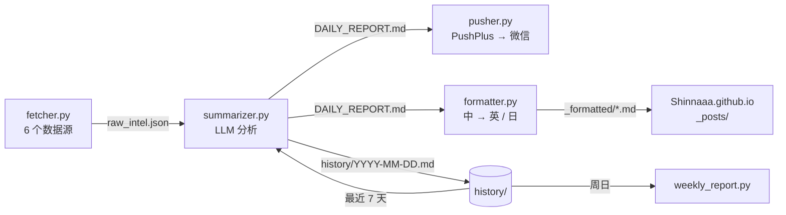

<p align="center">
  <a href="README.md"></a>
  <a href="README.zh-CN.md"></a>
  <a href="README.ja.md"></a>
</p>

<h1 align="center">TechTrend</h1>

<p align="center">
  每天早上自动读完 GitHub、Hugging Face、Hacker News、Reddit 和 Product Hunt，<br>
  用 LLM 写出有观点的技术分析，推送到微信，并同步发布为中英日三语博客。
</p>

<p align="center">
  <a href="https://github.com/Shinnaaa/TechTrend/actions/workflows/daily-intel.yml"></a>
  <a href="https://github.com/Shinnaaa/TechTrend/actions/workflows/weekly-intel.yml"></a>
  
</p>

---

## 为什么做这个

大多数"AI 资讯日报"只是把项目简介换个说法再讲一遍。TechTrend 反过来调教：每一条都必须有一个看标题想不到的洞见、一个点名道姓的具体对比、能拿到的真实数字、明确的局限，以及一件本周就能动手做的事。"值得关注""重新定义了 X"这类套话在 prompt 里明令禁止，并附有差/好写法示例让模型照着写。

## 你会收到什么

**每天北京时间 08:00（UTC 00:00）**，一份包含以下板块的简报：

| 板块 | 来源 |
|---|---|
| 🔥 GitHub Trending 精选 | GitHub Trending（全语言、Python、TypeScript） |
| 🤗 HuggingFace 热门模型 | Hugging Face 模型 API，按 `trendingScore` 排序 |
| 🧠 AI/ML 前沿论文 | Hugging Face Daily Papers |
| 💬 Hacker News 技术热点 | Algolia HN 首页 |
| 🧵 Reddit r/LocalLLaMA 今日热帖 | Reddit 当日 Top RSS |
| 🚀 Product Hunt 今日新品 | Product Hunt RSS |
| ⚡ 技术范式变化信号 | 跨来源综合判断，以最近 7 天为趋势背景 |
| 🛠️ 本周行动清单 | 可以立刻动手的 PoC、代码阅读或方案评估 |

示例条目：

> **[openwhispr](https://github.com/OpenWhispr/openwhispr)** `JavaScript` ⭐7,427 +121
> 💡 跨平台语音转文字应用，本地用 Nvidia Parakeet/Whisper、云端 BYOK，对比 OpenAI Whisper API 的按分钟计费，本地推理零边际成本……局限：BYOK 模式下用户需自行管理多家云厂商的 API key 和配额，体验碎片化。
> 🎯 本周在主力开发机上配置本地 Parakeet 模型，对比 Whisper API 在同样 10 段录音上的转录延迟和准确率。

**每周日北京时间 09:00**，周报会把过去 7 天的日报提炼成：本周最强信号、持续强化的趋势、新冒头的苗头、值得警惕的反向信号和下周关注重点。

## 工作原理



| 文件 | 职责 |
|---|---|
| `fetcher.py` | 抓取 6 个数据源，带重试。过滤掉 `seen_urls.json` 里已出现过的 URL，同一个项目不会被分析两次。 |
| `summarizer.py` | 用新条目加最近 7 天的日报标题拼成 prompt，调用模型，写出 `DAILY_REPORT.md` 和 `history/<日期>.md`。新条目少于 5 条时当天跳过。 |
| `pusher.py` | 通过 PushPlus 推送到微信，没有报告时什么都不做。 |
| `formatter.py` | 把报告翻译成英文和日文，三个版本包进语言块，加上 Jekyll front matter。 |
| `weekly_report.py` | 汇总 `history/` 里最近 7 份日报，生成并推送周报。 |

每日 workflow 会把 `seen_urls.json` 和 `history/` 提交回本仓库，让去重状态和趋势背景在多次运行之间保留（每周 workflow 提交 `history/weekly_*.md`）。然后把排版好的文章复制到 [Shinnaaa.github.io](https://github.com/Shinnaaa/Shinnaaa.github.io) 仓库，作为三语博客文章发布。

### 设计要点

- **推理预算。** 模型开启 thinking 模式运行。推理和正文共用同一个 `max_tokens` 预算，所以调用给到 7,000 token，并在每次运行时记录推理 token 数。如果正文仍然为空，会关闭 thinking、用 3,500 token 重试一次，两次都失败才报错。
- **翻译不开推理。** `formatter.py` 关闭 thinking：翻译用不上推理，开着只会多花一倍时间。翻译失败时退回全中文，不阻塞发布。
- **没新东西就不打扰。** 新条目少于 `MIN_NEW_ITEMS = 5` 时，当天既不推送也不发文。

## 配置

### 1. 仓库 Secrets

| Secret | 用途 |
|---|---|
| `OPENAI_API_KEY` | 任意 OpenAI 兼容接口的 key（目前是 DeepSeek 中转） |
| `OPENAI_BASE_URL` | 该接口的 base URL |
| `OPENAI_MODEL` | 模型名，例如 `deepseek-v4-flash` |
| `PUSHPLUS_TOKEN` | [PushPlus](https://www.pushplus.plus/) 微信推送 token |
| `SYNC_PAT` | 对网站仓库有写权限的 fine-grained PAT |

### 2. 运行

两个 workflow 都按计划自动运行。手动触发：

```bash
gh workflow run daily-intel.yml  --repo Shinnaaa/TechTrend
gh workflow run weekly-intel.yml --repo Shinnaaa/TechTrend
```

### 3. 本地运行

```bash
pip install -r requirements.txt

export OPENAI_API_KEY=...  OPENAI_BASE_URL=...  OPENAI_MODEL=deepseek-v4-flash
export PUSHPLUS_TOKEN=...

python fetcher.py && python summarizer.py && python pusher.py
```

## 故障排查

先跑 `gh run view <run-id> --log-failed`，看 API 调用返回的状态码：

| 现象 | 原因 |
|---|---|
| 模型 API 返回 `400` | 服务商改了模型名，更新 `OPENAI_MODEL` Secret |
| `402 Insufficient Balance` | API 账户余额不足 |
| formatter 报 `DAILY_REPORT.md is empty` | 模型把 token 预算全用在推理上了。查看日志里的推理 token 数，调大 `THINKING_MAX_TOKENS` |
| 周报提示 `No history files found` | 那一周没有一天日报成功，先修日报 |

## 仓库结构

```
.github/workflows/   daily-intel.yml、weekly-intel.yml
history/             每天一份 Markdown 简报，外加 weekly_*.md（由 CI 提交）
seen_urls.json       去重状态（由 CI 提交）
*.py                 流水线各阶段
AGENT.md             给 AI 编程助手的工作笔记：决策、踩坑、改动历史
```
