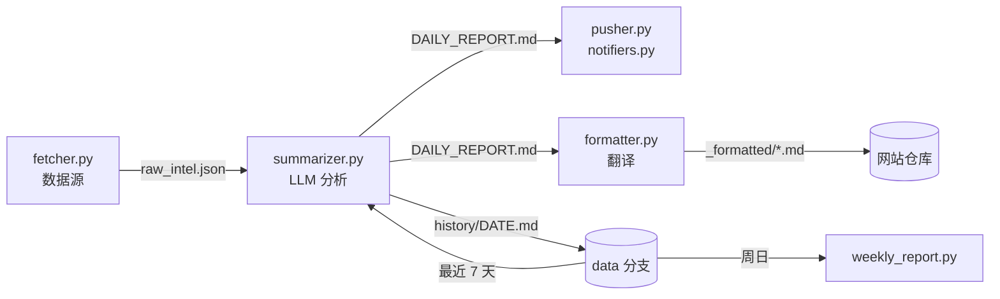

<p align="center">
  <a href="README.md"></a>
  <a href="README.zh-CN.md"></a>
  <a href="README.ja.md"></a>
</p>

<h1 align="center">TechTrend</h1>

<p align="center">
  每天自动读完 GitHub、Hugging Face、Hacker News、Reddit 和 Product Hunt，<br>
  用任意大模型写出有观点的技术分析，推送到微信、飞书、钉钉、Telegram、邮件等渠道。<br>
  免费跑在 GitHub Actions 上，不需要服务器。
</p>

<p align="center">
  <a href="https://github.com/Shinnaaa/TechTrend/actions/workflows/daily-intel.yml"></a>
  
  <a href="LICENSE"></a>
</p>

---

## 为什么做这个

大多数"AI 资讯日报"只是把项目简介换个说法再讲一遍。TechTrend 反过来调教：每一条都必须有一个看标题想不到的洞见、一个点名道姓的具体对比、能拿到的真实数字、明确的局限，以及一件本周就能动手做的事。"值得关注""重新定义了 X"这类套话在 prompt 里明令禁止，并附有差/好写法示例让模型照着写。

## 你会收到什么

**每天早上**一份这样的简报，可选中文、英文或日文：

> **[openwhispr](https://github.com/OpenWhispr/openwhispr)** `JavaScript` ⭐7,427 +121
> 💡 跨平台语音转文字应用，本地用 Nvidia Parakeet/Whisper、云端 BYOK，对比 OpenAI Whisper API 的按分钟计费，本地推理零边际成本……局限：BYOK 模式下用户需自行管理多家云厂商的 API key 和配额。
> 🎯 本周在主力开发机上配置本地 Parakeet 模型，对比 Whisper API 在同样 10 段录音上的转录延迟和准确率。

| 板块 | 来源 |
|---|---|
| 🔥 GitHub Trending 精选 | GitHub Trending（语言可自选） |
| 🤗 热门模型 | Hugging Face，按 `trendingScore` 排序 |
| 🧠 AI/ML 前沿论文 | Hugging Face Daily Papers |
| 💬 Hacker News 技术热点 | Algolia HN 首页 |
| 🧵 Reddit 热帖 | 自选版块的当日 Top |
| 🚀 Product Hunt 今日新品 | Product Hunt RSS |
| ⚡ 技术范式变化信号 | 跨来源综合判断，以最近 7 天为趋势背景 |
| 🛠️ 本周行动清单 | 可以立刻动手的 PoC、代码阅读或方案评估 |

每个来源都可以单独关掉。之前分析过的条目会自动跳过；新条目少于 5 条的日子不打扰你。**每周日**还有一份周报，提炼一周的最强信号和趋势。

---

## 快速开始

全程在浏览器里完成，大约 10 分钟。

### 1. Fork 本仓库

点右上角 **Fork**，保持勾选 **"Copy the `main` branch only"**：这样你的副本不会带上作者的历史数据，第一次运行时会自动创建你自己的。

### 2. 准备大模型 API Key

任何 OpenAI 兼容接口都可以。[`config.yml`](config.yml) 默认用 DeepSeek，价格低，中英文写作都不错：

| 服务商 | `llm.base_url` | `llm.model` | `llm.thinking` |
|---|---|---|---|
| DeepSeek（默认） | `https://api.deepseek.com` | `deepseek-v4-flash` | `true` |
| OpenAI | `https://api.openai.com/v1` | 你账号里的模型 id | `null` |
| Anthropic Claude | `https://api.anthropic.com/v1/` | 例如 `claude-sonnet-5` | `null` |
| Google Gemini | `https://generativelanguage.googleapis.com/v1beta/openai/` | Gemini 模型 id | `null` |
| 阿里通义千问 | `https://dashscope.aliyuncs.com/compatible-mode/v1` | 千问模型 id | `null` |
| 月之暗面 Kimi | `https://api.moonshot.cn/v1` | Kimi 模型 id | `null` |

不用 DeepSeek 的话，改一下 `config.yml` 里这三行（在 GitHub 上点铅笔图标就能直接在浏览器里改）。注意 `thinking: null`：`thinking` 参数是 DeepSeek 特有的，发给其他服务商可能会被拒绝。

### 3. 添加 Secrets

在你的 fork 里打开 **Settings → Secrets and variables → Actions → New repository secret**，添加：

- `OPENAI_API_KEY`：大模型的 key（名字是历史原因，填哪家的 key 都行）
- 下表中**至少一个推送渠道**的 Secrets。配置多个就会同时推送到多个地方。

### 4. 启用 Actions

Fork 出来的仓库默认禁用 Actions。打开 **Actions** 标签页，点 **"I understand my workflows, go ahead and enable them"**。

### 5. 测试

1. **Actions → Test Notifications → Run workflow**：每个已配置的渠道都会收到一条测试消息，日志里会列出哪些渠道已生效。
2. **Actions → Daily Tech Intel → Run workflow**：几分钟后收到第一份简报。

之后每天 UTC 00:00（北京时间 08:00）自动运行。想改时间，编辑 [`.github/workflows/daily-intel.yml`](.github/workflows/daily-intel.yml) 里的 `cron`（用的是 UTC：`0 23 * * *` 是东京 08:00，`0 1 * * *` 是北京 09:00）。

---

## 推送渠道

一个渠道的必填 Secrets 都配齐了就会生效。简报较长时，会按章节自动拆成多条，以适配各平台的消息长度上限。

| 渠道 | 必填 Secrets | 可选 | 获取方式 |
|---|---|---|---|
| 微信（PushPlus） | `PUSHPLUS_TOKEN` | | [pushplus.plus](https://www.pushplus.plus/) → 微信扫码登录 → 复制 token |
| 微信（Server酱） | `SERVERCHAN_SENDKEY` | | [sct.ftqq.com](https://sct.ftqq.com/) → SendKey |
| 企业微信群机器人 | `WECOM_WEBHOOK_URL` | | 群聊 → ⋯ → 添加群机器人 → 复制 Webhook 地址 |
| 飞书 / Lark 群机器人 | `FEISHU_WEBHOOK_URL` | `FEISHU_SECRET` | 群设置 → 群机器人 → 自定义机器人 → Webhook 地址（开启签名校验时再填密钥） |
| 钉钉群机器人 | `DINGTALK_WEBHOOK_URL` | `DINGTALK_SECRET` | 群设置 → 机器人 → 自定义 → Webhook 地址（安全设置选"加签"时再填密钥） |
| Telegram | `TELEGRAM_BOT_TOKEN`、`TELEGRAM_CHAT_ID` | | 用 [@BotFather](https://t.me/BotFather) 创建 bot；给它发一条消息，再从 `https://api.telegram.org/bot<token>/getUpdates` 读出 chat id |
| Discord | `DISCORD_WEBHOOK_URL` | | 频道设置 → 整合 → Webhook → 新建 → 复制 URL |
| Slack | `SLACK_WEBHOOK_URL` | | [创建 App](https://api.slack.com/apps) → Incoming Webhooks → 添加到频道 |
| 邮件（SMTP） | `SMTP_HOST`、`SMTP_USERNAME`、`SMTP_PASSWORD`、`EMAIL_TO` | `SMTP_PORT`（465）、`EMAIL_FROM` | 邮箱服务商的 SMTP 设置。QQ 邮箱：`smtp.qq.com` + 授权码；Gmail：`smtp.gmail.com` + [应用专用密码](https://myaccount.google.com/apppasswords)。`EMAIL_TO` 可以用逗号分隔多个地址 |
| ntfy（手机推送） | `NTFY_TOPIC` | `NTFY_SERVER`、`NTFY_TOKEN` | 取一个不容易被猜到的 topic 名，在 [ntfy App](https://ntfy.sh/) 里订阅 |
| 自定义 Webhook | `WEBHOOK_URL` | | 会收到 `POST {"title", "content", "format": "markdown", "language"}` |

只想推送到其中几个渠道时，在 `config.yml` 的 `notify.channels` 里列出它们。

---

## 配置

所有非密钥设置都在 [`config.yml`](config.yml)。几个例子：

**给前端团队的英文简报**

```yaml
report:
  language: en
  focus: "前端和浏览器技术：React、构建工具、CSS、Web API、性能。"
```

**多加几个 Reddit 版块、换 GitHub 语言、关掉 Product Hunt**

```yaml
sources:
  github_trending:
    languages: [all, rust, go]
  reddit:
    subreddits: [LocalLLaMA, MachineLearning, programming]
  product_hunt:
    enabled: false
```

| 配置项 | 默认值 | 含义 |
|---|---|---|
| `report.language` | `zh` | 简报和推送标题的语言：`zh`、`en`、`ja` |
| `report.focus` | 空 | 读者关注的方向，影响挑选条目和写法 |
| `report.min_new_items` | `5` | 新条目少于这个数时当天跳过 |
| `llm.model`、`llm.base_url` | DeepSeek | 接口地址和模型；`OPENAI_MODEL` / `OPENAI_BASE_URL` 这两个 Secret 或 Variable 优先 |
| `llm.thinking` | `true` | DeepSeek 推理开关；其他服务商设为 `null` |
| `llm.max_tokens` | `7000` | token 预算（开启推理时，推理和正文共用） |
| `sources.<name>.enabled` / `max_items` | 全部开启 | 每个来源的开关，以及交给模型的条目数 |
| `notify.channels` | `[]`（所有已配置的） | 只推送到这些渠道 |
| `weekly.enabled` | `true` | 周日周报 |
| `website.languages` | `[zh, en, ja]` | 可选网站文章的语言 |

---

## 可选：发布到网站

每份简报还可以自动变成 Jekyll 网站上的一篇文章，并翻译成 `website.languages` 里的语言（作者自己的站点：[shinnaaa.github.io](https://shinnaaa.github.io/intel/)）。

1. 添加仓库 **Variable**（Settings → Secrets and variables → Actions → Variables）：`WEBSITE_REPO` = `你的用户名/网站仓库`。
2. 添加 Secret `SYNC_PAT`：一个对该仓库有 *Contents: read and write* 权限的 [fine-grained token](https://github.com/settings/personal-access-tokens)。

文章会写到 `_posts/YYYY-MM-DD-intel.md`：每种语言一个 `<div class="lang-block" lang="…">`，front matter 里带 `title_<语言>` 和 `highlights`，供网站模板使用。

---

## 工作原理



| 文件 | 职责 |
|---|---|
| `config.yml`、`config.py` | 配置、默认值、路径 |
| `fetcher.py` | 带重试地抓取已启用的来源，过滤掉之前出现过的 URL |
| `summarizer.py` | 用新条目加最近 7 天的标题拼成 prompt，调用模型 |
| `notifiers.py`、`pusher.py` | 推送渠道；`pusher.py --list` / `--test` 用于检查配置 |
| `formatter.py` | 可选的网站文章：翻译、语言块、front matter |
| `weekly_report.py` | 周日汇总本周简报 |
| `scripts/state.sh` | 在 `data` 分支上读写运行数据 |

**运行数据存放在 `data` 分支**（`history/` 里是每一份简报，`seen_urls.json` 用于去重）。workflow 每次运行时把它取到 `data/` 目录，结束后提交回去。所以 `main` 分支只放代码，不会被机器人的每日提交刷屏。这个分支在第一次运行时自动创建。

### 设计要点

- **推理预算。** 开启 DeepSeek 推理时，推理和正文共用一个 `max_tokens` 预算。每次调用都会记录推理 token 数；如果正文为空，会关闭推理重试一次。
- **先保存数据，再推送。** 推送渠道出问题也不会导致第二天重复分析同样的条目。
- **单个渠道失败不影响其他渠道。** 只有所有渠道都失败时，推送步骤才会报错。

---

## 本地运行

```bash
pip install -r requirements.txt
cp .env.example .env        # 填入 OPENAI_API_KEY 和至少一个渠道
python pusher.py --list     # 查看哪些渠道已配置
python pusher.py --test     # 发送测试消息

python fetcher.py && python summarizer.py && python pusher.py
```

本地运行时数据保存在 `./data/`（已被 git 忽略）。运行测试：`pip install pytest && pytest`。

## 故障排查

在 Actions 页面打开失败的那次运行，或者用 `gh run view <run-id> --log-failed`。

| 现象 | 原因 |
|---|---|
| 模型 API 返回 `400` 并提到 `thinking` | 你用的不是 DeepSeek：设置 `llm.thinking: null` |
| `400` / `404` 找不到模型 | 模型名错了或被服务商改名了：修改 `llm.model` 或 `OPENAI_MODEL` |
| 模型 API 返回 `401` | `OPENAI_API_KEY` 不对，或者和 `llm.base_url` 不是同一家 |
| `402 Insufficient Balance` | API 账户余额不足 |
| 警告 `No push channel configured` | 没有任何渠道的必填 Secrets 配齐，见上面的渠道表 |
| `Model returned an empty report` | 推理用完了全部预算：调大 `llm.max_tokens` |
| 运行成功但没收到，日志里有 `skipping` | 当天新条目少于 `min_new_items`，这是设计行为 |

## 参与贡献

新增一个推送渠道，只需要在 [`notifiers.py`](notifiers.py) 里加一个函数和一条 `Channel(...)`，再在 `tests/` 里补一个测试。新增一个数据源，需要在 `fetcher.py` 里加抓取函数，在配置里加一项，并在 `summarizer.py` 里加对应章节的写法说明。欢迎提 Issue 和 PR。

## 许可证

[MIT](LICENSE)
